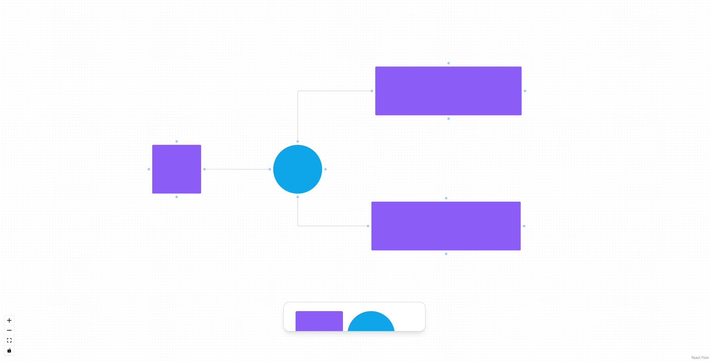

# **FIG JAM UI**

## &#127919; **About**

Um clone da ui do figjam, usando o react flow para funcionalidades de nodes

## 📋**My Experience**

Fiz esse projeto sobre orientação do professor Diego da RockerSeat, foi muito bom para conheçer um pouco das capacidades da bliblioteca React flow, e entender um pouco sobre o TailWind CSS.

## 🔧 **Techs**

- REACT
- TYPESCRIPT
- TAILWIND
- REACT FLOW

## &#127775; **Features**

&#10004; Layout do Fig Jam &#10004; Criar diferentes nodes &#10004; Ligações entre nodes

